Westman Naturalists Inc. is incorporated as a non-profit corporation and
organized by a team of volunteers.

Everyone is welcome to our events, but you'll have to be [a
member](membership.html) if you want to join the board! Check out [our
bylaws](bylaws.html) to see what we're all about, and feel free to send us [an
email](mailto:contact@westmannaturalists.ca) with any questions.

## Board of Directors

### Alex Koiter

::: {.column-margin}
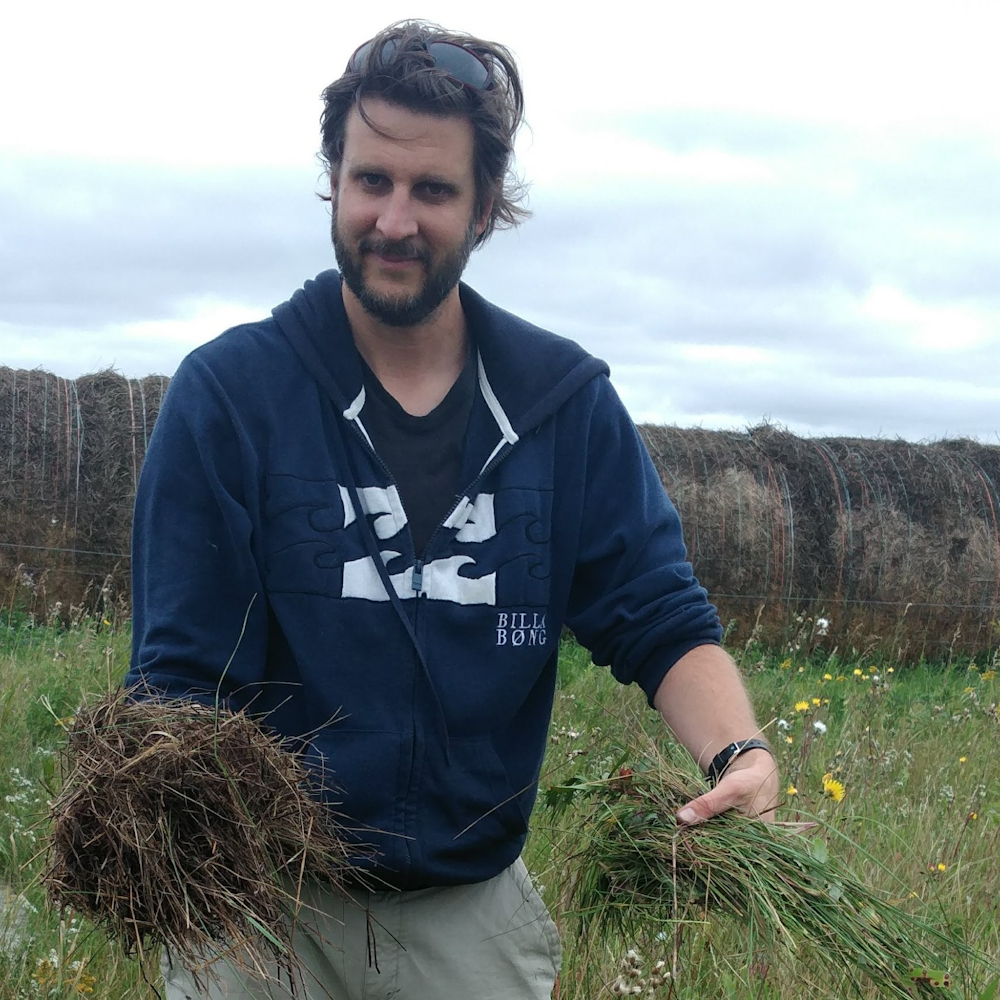{fig-alt="" title="Alex Koiter"}
:::

[**President**]{.large}  **Committees**: Speakers

Alex is an Associate Professor in Geography and Environment at Brandon
University. Alex enjoys leading trips to explore local Westman landscapes and
glacial history.

::: {style="margin-bottom: 30px"}
<!-- Add a spacer to create space below the image -->
:::

### Jen Wasko
::: {.column-margin}
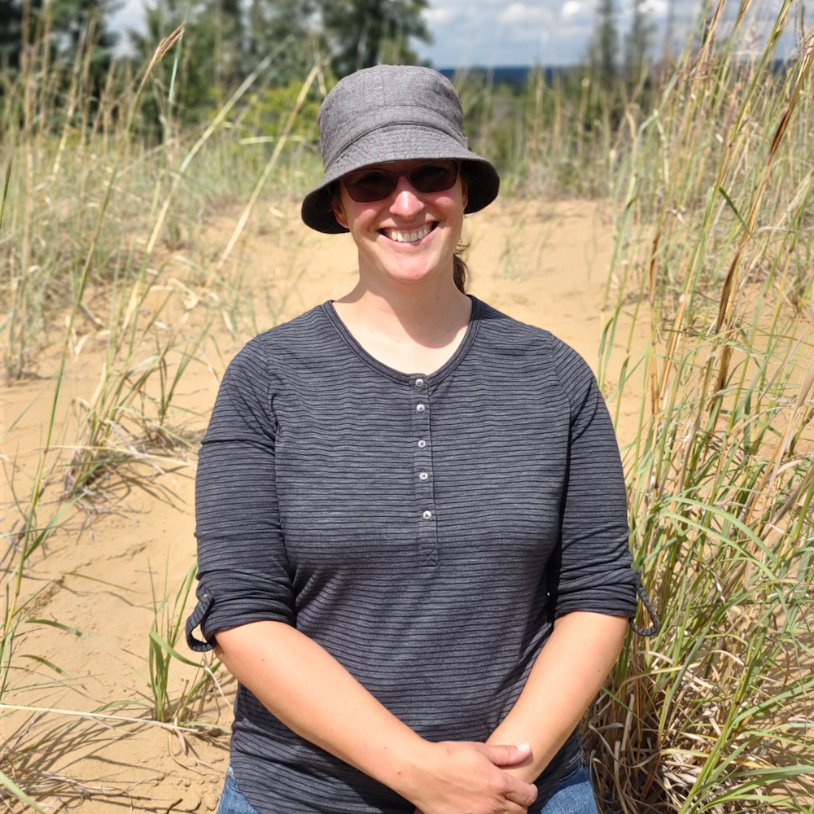{fig-alt="" title="Jen Wasko"}
:::

[**Vice-President**]{.large}  **Committees**: Financial and Planning

Jennifer Wasko is an Horticulture Instructor at Russ Edwards School of
Agriculture and Environment at Assiniboine College. When not experimenting with
gardening techniques, and spending time with her family, she loves exploring all
aspects of nature and sharing this love of the diverse Manitoba ecosystems with
others.

### Kathryn Hyndman

::: {.column-margin}
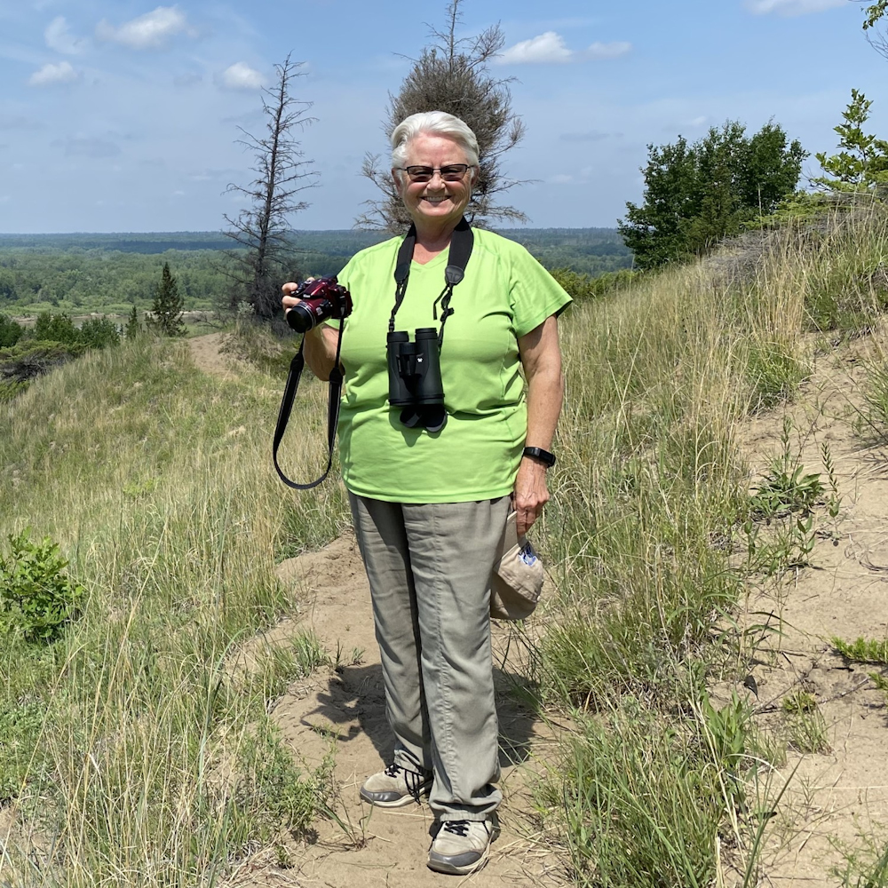{fig-alt="" title="Kathryn Hyndman"}
:::

[**Secretary**]{.large}  **Committees**: Financial and Planning

Hello! Kathryn is a retired registered nurse and former nursing professor at
Brandon University. Her passions include scuba diving and travelling. Many of
her trips involve watching and photographing birds and animals as well as marine
fish.

### Sandy Hominick

::: {.column-margin}
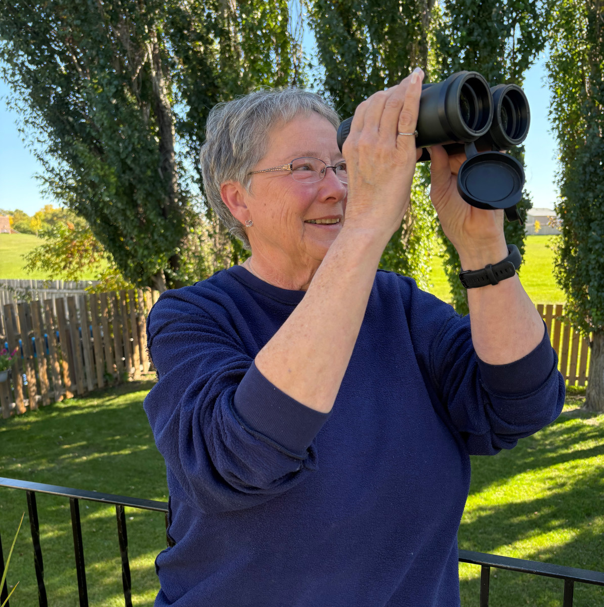{fig-alt="" title="Sandy Hominick"}
:::

[**Treasurer**]{.large}  **Committees**: Financial and Planning, Outings

Sandy's mom shared her love of birds with Sandy at an early age. Sandy has been
feeding birds for many years, and now that she's retired, is able to spend more
time birdwatching. You can find Sandy out and about in both the prairies and
sloughs of Manitoba and North Dakota!

### Adrielle Parlee

::: {.column-margin}
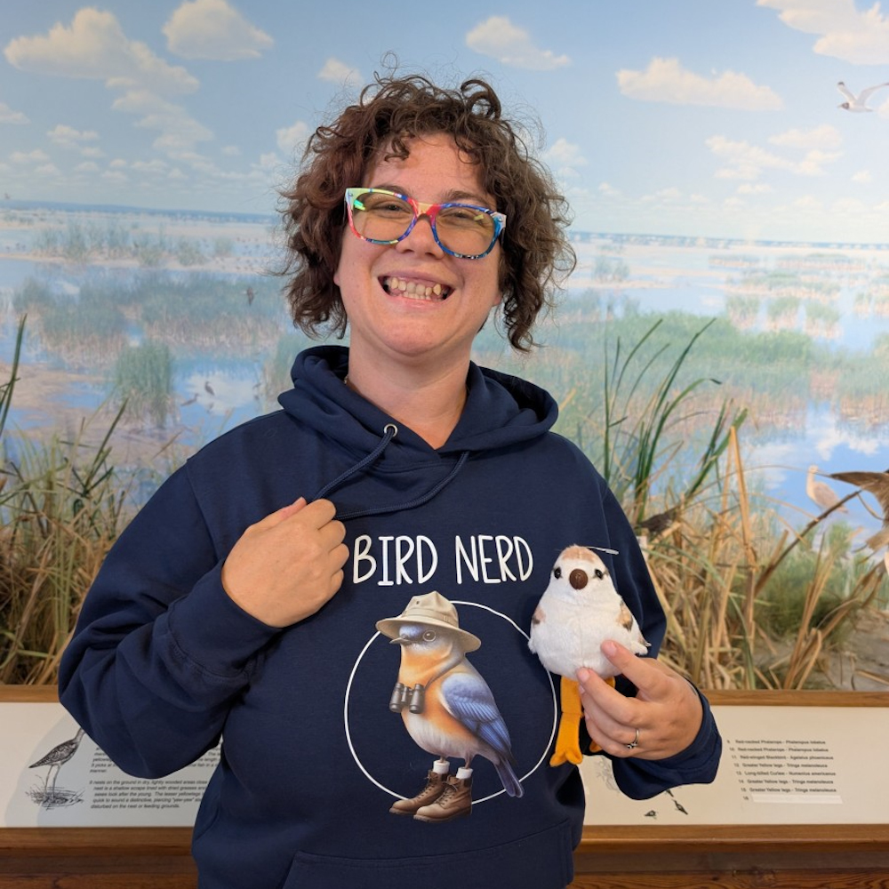{fig-alt="" title="Adrielle Parlee"}
:::

**Committees:** Outings

Adrielle's grandparents on both sides were birders and fostered an early love of
birds. Her favourite birds are probably chickadees and black terns and she is
hoping to see 600 bird species before 60. Adrielle and her wife are already
dreaming of a retirement spent birding and geocaching from a van all around
Canada. Besides birding, Adrielle loves reading, walking, and learning. Adrielle
currently works at the Westman Regional Library and is pursuing a diploma in
Library and Information Technology.

### Carson Kearns
::: {.column-margin}
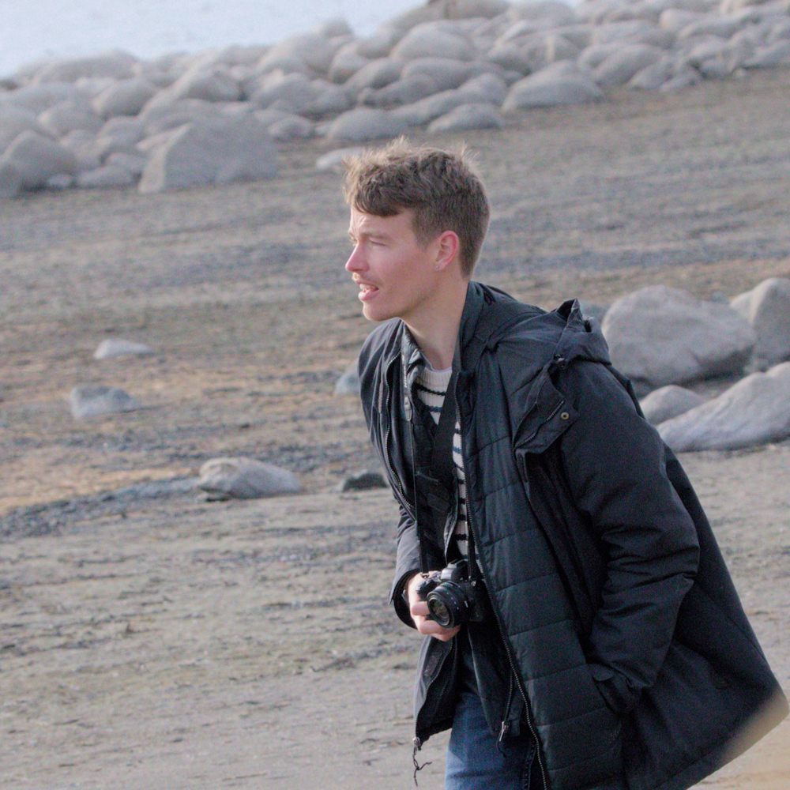{fig-alt="" title="Carson Kearns"}
:::

**Committees**: Communications

Carson likes birds and other things. Such as squirrels.

::: {style="margin-bottom: 70px"}
<!-- Add a spacer to create space below the image -->
:::

### Duane Diehl
::: {.column-margin}
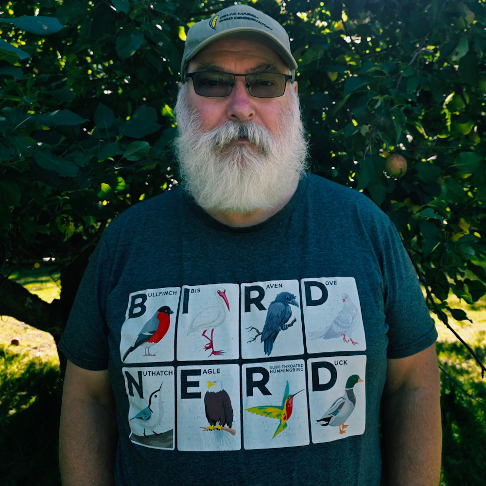{fig-alt="" title="Duane Diehl"}
:::

**Committees**: Speakers, Outings

Duane was raised in southwestern Manitoba and has always had an interest in
nature. After a BSc in Information Technology, he worked in the field for a
number of years in Winnipeg before taking the Manager of Computer Services
position at Assiniboine College. Since his retirement, he has spent much more
time in nature pursuing knowledge about our ecosystem, but with some emphasis on
birding.

### Gillian Richards
::: {.column-margin}
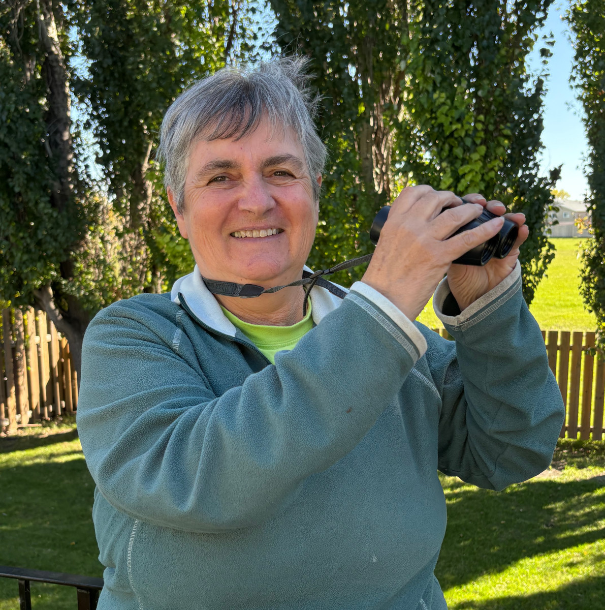{fig-alt="" title="Gillian Richards"}
:::

**Committees**: Communications (Newsletter, Email), Financial and Planning,
Outings  **Other**: [Christmas Bird Counts](christmas_bird_counts.html)

Gillian is an avid birder and an eBird enthusiast. Although birds catch her eye,
Gillian also spends time brushing up on butterflies and native plants. Her
passion is leading trips and sharing her knowledge of Westman nature.

::: {style="margin-bottom: 30px"}
<!-- Add a spacer to create space below the image -->
:::

### Roger Glufka

::: {.column-margin}
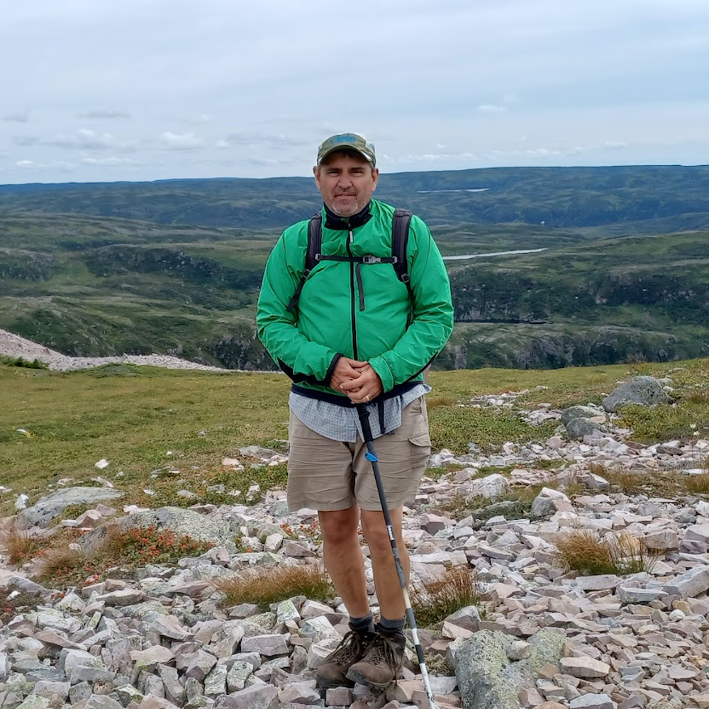{fig-alt="" title="Roger Glufka"}
:::

**Committees**: Outings

Roger fostered a love of birding and native plants, especially wild
strawberries, hanging out on the family farm with his grandma. A naturalist
position with Parks Canada in the 1990s and early 2000s encouraged him to deepen
his knowledge of Manitoba plants, animals, geography, and human history. Roger
enjoys hiking, camping, and canoeing in the summer, and cross-country skiing and
snowshoeing in the winter with his three grown children and their partners, his
dogs, and his wife.

### Steffi LaZerte

::: {.column-margin}
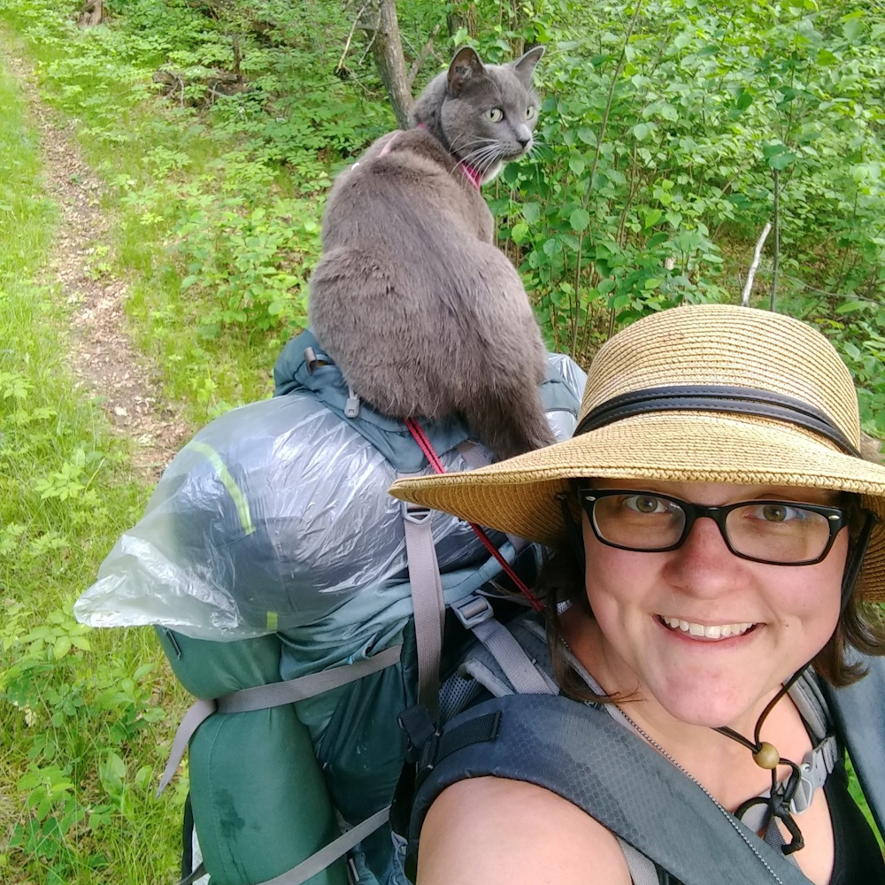{fig-alt="" title="Steffi LaZerte"}
:::

**Committees:** Speakers, Communications (Webmaster, Events Advertising)

Steffi is an independent biologist and R consultant and avid gardener. Steffi
enjoys getting away from her computer to explore Westman nature, taking her cats
if she can!

## In Memoriam

#### Glennis Lewis

::: {.column-margin}
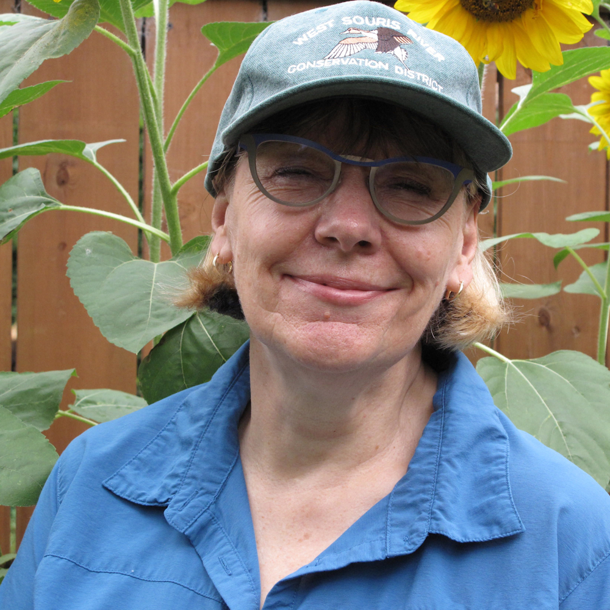{fig-alt="" title="Glennis Lewis"}
:::

Glennis Lewis was a retired botanist and lawyer who taught environmental impact
assessment at Brandon University. She lead numerous field trips for Westman
Naturalists. Glennis was a founding member of Westman Naturalists and was
pivotal in the creation and development of our group.

## Alumni

[**Many thanks!**]{.large}

- Erica Alex
- Carson Rogers
- Megan Hamill
- Colin Blyth
- Bill Gallaway
