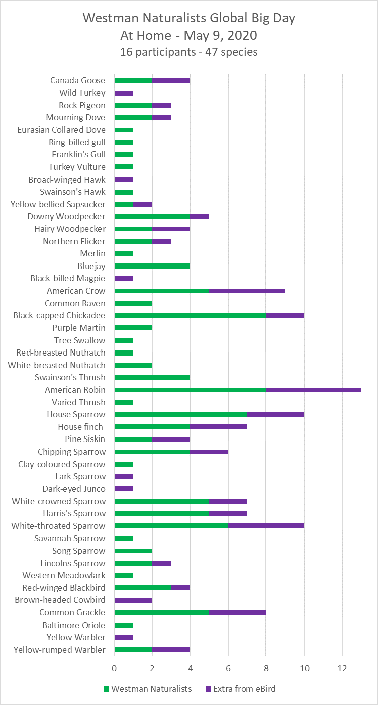

#### Table of Contents

1. [Westman Naturalists' Big Day 2020](#westman-naturalists-big-day-2020) *May 19th, 2020*
1. [The Dragons Are Coming!](#the-dragons-are-coming) *May 1st, 2020*
2. [Naturalists at Home](#naturalists-at-home) *April 9th, 2020*

-------

## Westman Naturalists' Big Day 2020

Here are the results from the Westman Naturalists' Big Day (May 9th 2020)

Thanks to the 9 groups (11 people) who contributed to our unofficial Westman Global Big Day. 
Between us we recorded 40 species from our yards. 
6 more species were gained by adding 4 more contributors from eBird (see below). Not too bad for staying home. 

Just for comparison, a few people ventured a mile or so away from their yards on May 9 - giving a total of 28 lists on eBird and 82 species for the Brandon area on eBird. 
That's just less than the record 84 recorded on May 14 2016. 


```{r, out.extra= "class = 'img-center' style='width: 60%;max-width:100%;'", echo = FALSE} 

```


-------

## The Dragons Are Coming!

**Bill Gallaway, Westman Naturalist**  
*May 1st, 2020*

Spring is here, sort of! The bird migration has started - the Snowy Owls are leaving, the ducks and geese are arriving, the raptor migration is in full swing, the arctic and boreal sparrows and finches are here for a while, soon we will be seeing the insectivorous songbirds, shorebirds and the dragonflies. Yup, dragonflies! Of the 70+ species of dragonflies found in Manitoba two are migratory, the Common Green Darner and the Variegated Meadowhawk. Individuals of both of these species can be found in Manitoba from mid-April onwards, the early individuals have flown here from southern climes.


```{r, out.extra= "class = 'img-left' style='width:300px;max-width:100%'", echo = FALSE} 
knitr::include_graphics("images/20200421_142924837_iOS.jpeg")
```
The Common Green Darner (left) can’t be missed, it is big and it is lime green. From the picture it is obvious that they are very visible and unless you are in a lime orchard a Common Green Darner is hard to miss.

The Variegated Meadowhawk (right) is smaller and has a two white stripes on each side of its thorax with a yellow dot at the bottom of each stripe. Remember the yellow dots, because these can be used to differentiate these meadowhawks from Red-veined Meadowhawks, which can be found later in the season.

```{r, out.extra= "class = 'img-right' style='width:300px;max-width:100%'", echo = FALSE} 
knitr::include_graphics("images/20200421_142730465_iOS.jpeg")
```

The spring movements of these dragonflies are not as well documented as their fall movements. The fall southward migration of eastern North American populations of Common Green Darners is well studied. Common Green Darners move extraordinary distances with a southward movement of up to 100km in a day.
Throughout their range there are also local populations of these dragonflies that overwinter as larvae in the ponds that they develop in. The mass movement of migrant individuals and the mixing of these dragonflies with local populations has an interesting result. Genetically they are all the same population with no separate “races or subspecies” and other than the destruction of larval habitats local extinctions are not likely to occur.
So when out birding this spring don’t only look for birds, also keep an eye-out for dragonflies. And, perhaps, you too will find yourself looking for Ebony Bog Haunters, Dragon Hunters, Rusty Snaketails and the many other dragonflies found in Manitoba.

For those looking for more information:

- [Naturenorth.com](http://naturenorth.com) has Families, Photos and a cleverly hidden Checklist of Manitoba dragonflies
- ["Sky Hunters, The World of the Dragonfly - The Secrets of Nature"](https://www.youtube.com/watch?v=knlXTU1R_rE) is an hour-long YouTube documentary
- For those into citizen science there is an app, “Dragonfly ID”, with pictures, descriptions and distribution maps. The associated web-site <https://www.odonatacentral.org/#/>

------------------------

## Naturalists at Home
**Gillian Richards**  
*April 9th 2020* 

### Safe birding

- Birds Canada has information on [birding safely](https://www.birdscanada.org/responding-to-covid-19-what-birds-canada-is-doing-and-how-you-can-help/) in these times; for example citizen science (owl survey) is suspended for now, except close to home.
- Cornell also has a good post on [birding mindfully](https://ebird.org/canada/news/please-bird-mindfully)
- Here in Manitoba, as you know the message, is to “Stay home”, and if you do go out please physically distance. Also, if you do consider driving on a back-lane or dirt road be aware that they are muddier than usual at this time of year!


### Fun things to do

**Nature Manitoba’s** site has some interesting content. They recently publicized:

- [100 birds 100 years Contest](http://naturemanitoba.ca/100-birds-100-years) with a checklist, as part of their 100th birthday celebration.
- Parts 1 & 2 of a series of articles ["A Snapshot of Butterflies"](http://naturemanitoba.ca/news-articles/snapshot-butterflies-southeast-manitoba-parts-1-2)
- A [Naturalist's Colouring Book](https://www.heatherhinam.com/about) from local ecologist and artist, Heather Hinam.

**BBC** (British Broadcasting Corporation) – [some spectacular photos](https://www.bbc.com/news/in-pictures-52007548)

**Birds Canada** has many resources on their [site](https://www.birdscanada.org/) including a [page](https://www.birdscanada.org/apps/checklist/index.jsp) where you can click your location and find out what birds are likely to be around at the moment.

The **Cornell Lab of Ornithology** is a [great resource](https://www.birds.cornell.edu/home) with tons links and activities including a lot of educational resources for kids of all ages.

- The [Cornell Lab Bird Academy](https://academy.allaboutbirds.org/course-list/) has lots of free content plus various courses. Other tabs on this page lead to a selection of 175 short videos, learning games for kids of all ages and open lectures – videos of past Cornell Lab Seminars.
- [eBird](https://ebird.org/about) is a great way to track your sightings while participating in a world-wide citizen science project used for bird research, distribution maps and more. If you have difficulty getting set-up [eBird Essentials](https://academy.allaboutbirds.org/product/ebird-essentials/) is a free guide; or email us for “local” help.
- eBird also has [online resources](https://ebird.org/news/online-resources-to-enjoy-birds-from-your-home) to enjoy birds from your home
- [All About Birds](https://www.allaboutbirds.org/news/) lives up to its name with ID resources, live cams, courses and more

**Audubon** also has a good selection of [nature related activities](https://www.audubon.org/get-outside/activities) for all.

