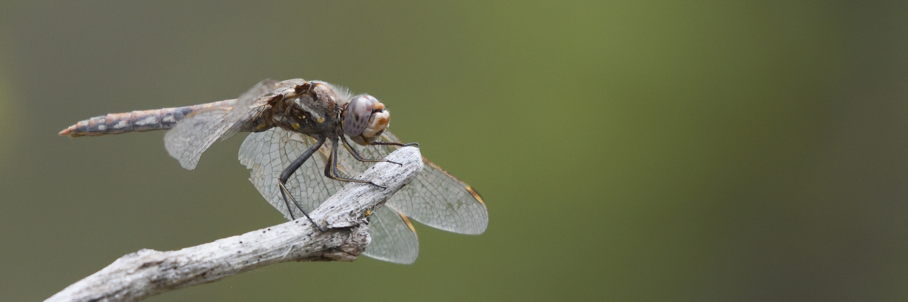

## Submit Your Photos for Our 2027 Calendar

We're making another calendar and we need your southwestern Manitoba nature photos!

Please send us [an email](mailto:contact@westmannaturalists.ca) if you're interested in submitting photos.
We'll send back a link for you to upload your photos, in order to avoid possible quality loss and email size limitations.

We'll need to know when and where each photo was taken, and what's in it. We're looking for photos taken in the
Westman region, bonus points if it's from one of our outings but that is by no means necessary!

Submissions will be open until the end of October, and we plan on having the calendars available by December.

### Slightly Technical Details for Submissions

The photos will be cropped square in the calendar, but please submit uncropped copies of your photos so we
have room to move things around and work with description/credit labels.

Each photo will be labelled with the species name (if it's an animal/plant/fungi) or other details
(the name of a trail, for example), the approximate location of the photo, and your name.

Please try to submit photos from throughout the year. You probably have lots of photos from the spring and
summer months, but last year we only had one photo submitted for November!

## Buy a Westman Naturalists Calendar

Buying our calendar is a great way to support us (and makes for an ~~easy~~ great gift in December). Send us an email or ask a board member at a talk/outing about getting your hands on a neat little desk calendar.

::: {.column-screen}
{fig-alt="Meadowhawk Dragonfly"}
:::

## Our First Calendar!

Our 2026 calendar was a great success! We had eighteen photos from eight Westman Naturalists members
to fill out the calendar.
Thank you to Alex, Amanda, Carson, Denice, Duane, Gillian, Kat, and Kathryn for your photos!
