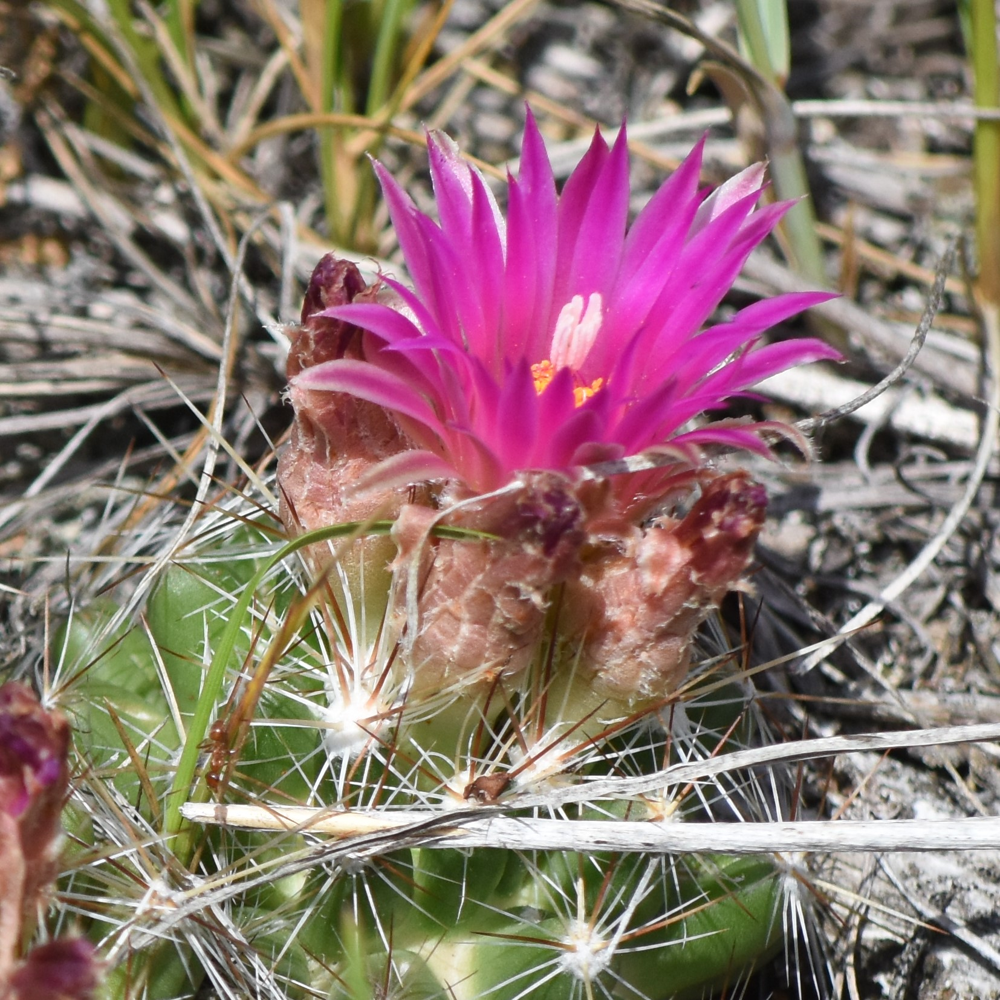

```{r, out.extra= "class='img-right'", echo = FALSE} 

```


There is so much to see and do in this corner of Manitoba!

Events range from casual walks through city parks, to bird watching along rivers and wetlands, to public talks by local experts.

Enjoy!

### Current situation {.notice}
We are adapting to changing situations. Right now we're focusing on online presentations but may resume outings when the Westman situation improves. 

<!-- 
**Westman Naturalists are venturing outside!**

We will follow current public health guidelines for all our outings, please assess the risks based on your own situation. For more details please see [our protocols](resources.html). We are limiting groups to a maximum of 15, so sign-up is required for each outing.  We have listed a few outings below, and will add more. We are also looking into additional webinar presentations. -->


```{r, message = FALSE, warning = FALSE, echo = FALSE}
library(dplyr)
library(stringr)
library(tidyr)
library(purrr)
library(lubridate)
library(glue)
library(googlesheets4)

gs4_deauth()

events <- gs4_get("https://docs.google.com/spreadsheets/d/132krSjS7w574gavkX31XxmcmmafXbC-zfM81W2mDXAY/") %>%
  read_sheet() %>%
  mutate(month = month(Start),
         year = year(Start),
         Start = as_date(Start),
         Start = replace(Start, Tentative == "yes", as_date(NA)),
         Date = format(Start, "%A, %b %d %Y"),
         Date = replace_na(Date, "TBA"),
         Time = map(Time, as.character)) %>%
  mutate(Time = map(Time, ~replace(.x, length(.x) == 0, "All day"))) %>%
  unnest(cols = "Time") %>%
  mutate(Time = if_else(str_detect(Time, "[0-9]{4}-[0-9]{2}"), format(as_datetime(Time), "%I:%M %p"), Time)) %>%
  mutate(Time = str_remove(Time, "^0"),
         Description = str_replace_all(Description, 
                                       "westman.naturalists@gmail.com", 
                                       "[westman.naturalists@gmail.com](mailto:westman.naturalists@gmail.com)"),
         Extra = if_else(Extra != "", glue("<div class = 'notice'>\n\n{Extra}\n\n</div>"), ""),
         Status = if_else(tolower(Status) == "cancelled",
                          "**<span class='notice'>Cancelled</span>** ", ""),
         Hosted = replace_na(Hosted, "Westman Naturalists"),
         Footer = if_else(str_detect(Hosted, "Westman Naturalists"), 
                          "[Contact Westman Naturalists for more information](mailto:westman.naturalists@gmail.com)",
                          "Note that this event is not hosted by Westman Naturalists"),
         Hosted = glue("Hosted by {Hosted}"),
         event = glue("{Extra}\n\n",
                      "{Status}<span class = 'date'>{Date}</span>\n\n",
                      "<span class = 'event-title'>{Title}</span>; {Hosted}\n\n",
                      "{Description}\n\n", 
                      "**Time**: {Time}<br>",
                      "**Location**: {Location}\n\n",
                      "{Footer}", .na = ""),
         past = Start < Sys.time(),
         past = replace_na(past, FALSE))
```


## Upcoming Events

Everyone is welcome to join in on any and every event!

Please remember to dress for the weather, bring water and bug spray, and food for outings.
<!-- To aid in planning, please let us know if you are attending any of our out of town trips, by [sending the Westman Naturalists an email](mailto:westman.naturalists@gmail.com). -->


```{r, echo = FALSE, results = "asis"}
upcoming <- filter(events, !past) %>%
  arrange(Start) %>%
  nest(data = c(-month))

if(nrow(upcoming) == 0){
  cat("> **Nothing planned at the moment, but check back!**")

} else {
  for(m in upcoming$month) {
    print(glue("\n\n## ", as.character(month(m, label = TRUE, abbr = FALSE)), "\n\n"))
    
    filter(upcoming, month == m) %>%
      unnest(cols = data) %>%
      pull(event) %>%
      glue_collapse(sep = "\n\n-----\n\n") %>%
      print()
  }
}
```


--------

## Previous Events
```{r, echo = FALSE, results = "asis"}
past <- filter(events, past) %>%
  arrange(desc(Start)) %>%
  nest(data = c(-year, -month))

for(i in seq_len(nrow(past))) {
  m <- past$month[i]
  y <- past$year[i]
  
  print(glue("\n\n## {as.character(month(m, label = TRUE, abbr = FALSE))} {y}\n\n"))
  
  past[i, ] %>%
    unnest(cols = data) %>%
    pull(event) %>%
    glue_collapse(sep = "\n\n-----\n\n") %>%
    print()
}
```

