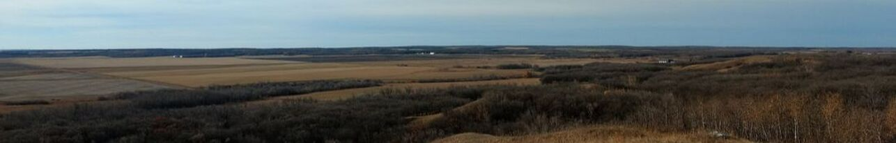

## Welcome!

We are a group of amateur naturalists with the goal of exploring and enjoying the natural beauty and history of southwestern Manitoba. From wildlife to wildflowers and everything in between. Come experience what Westman has to offer!

We host outings throughout the year, usually on weekends. In the spring and summer months we have evening walks every second Wednesday. And through autumn and winter, we host talks at Brandon University on topics ranging from identification tips to trip reports and fun facts about bugs!

## Checkout Our Next Event!


```{r}
#| results: asis
library(dplyr)
library(glue)
library(lubridate)

next_event <- readRDS("events.rds") |>
  arrange(date) |>
  #filter(stringr::str_detect(title, "Duck")) |>
  filter(date >= Sys.Date() & !cancelled) |>
  slice(1) |>
  #mutate(print = if_else(image != "", glue(event, "\n\n", "{{.big-figure}}"), event))
  mutate(
    event_link = glue("events.html#{tolower(month(.data$month, label = TRUE, abbr = FALSE))}"),
    print = if_else(image != "" & !is.na(image),
                    glue("[{{.med-figure fig-alt=\"Image of event poster from facebook\"}}]({event_link})"),
                    ""), 
    print = glue("{print}\n\n**[{title}]({event_link})**<br>{date_pretty}<br>{location}")
  )

print(next_event$print)
```


See more upcoming and past events on our [events page](events.html).